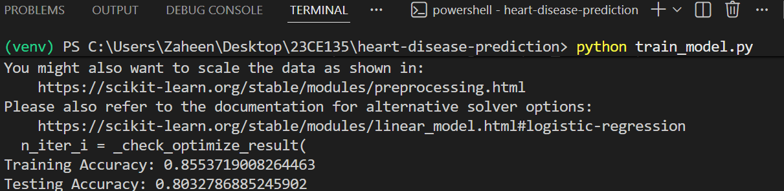
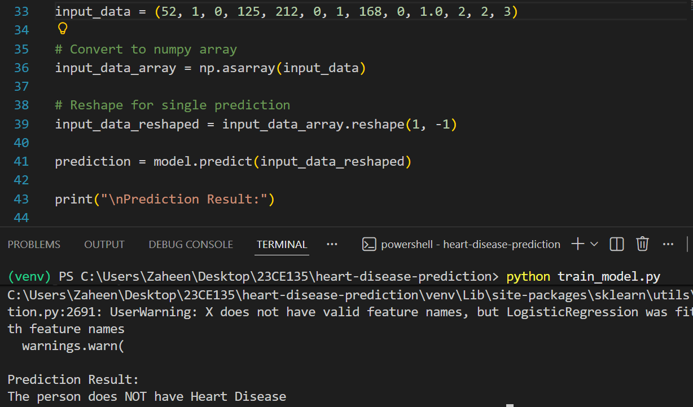

#  Heart Disease Prediction System using Machine Learning

An end-to-end Machine Learning-based classification system that predicts the likelihood of heart disease using structured clinical patient data.

This project demonstrates a complete supervised learning pipeline including data preprocessing, feature engineering, model training, evaluation, and terminal-based prediction deployment.

---

##  Project Overview

Heart disease remains one of the leading causes of mortality worldwide. Early prediction using machine learning can assist in preventive healthcare planning.

This system:

- Analyzes clinical health parameters
- Trains a Logistic Regression classification model
- Evaluates model performance using accuracy metrics
- Allows real-time manual patient input via terminal
- Outputs disease prediction instantly

This project follows a structured, reproducible ML workflow suitable for healthcare analytics prototyping.

---

## 🏗 System Architecture

Dataset → Preprocessing → Train-Test Split → Model Training → Model Evaluation → Manual Prediction

The design is modular and easily extendable for future improvements.

---

## 📦 Dataset Description

The dataset contains patient-level clinical attributes:

- Age
- Sex
- Chest Pain Type (cp)
- Resting Blood Pressure (trestbps)
- Serum Cholesterol (chol)
- Fasting Blood Sugar (fbs)
- Resting ECG Results (restecg)
- Maximum Heart Rate Achieved (thalach)
- Exercise Induced Angina (exang)
- ST Depression (oldpeak)
- Slope of Peak Exercise ST Segment (slope)
- Number of Major Vessels (ca)
- Thalassemia (thal)
- Target (0 = No Disease, 1 = Disease)

---

## 🧠 Machine Learning Approach

### 🔹 Problem Type
Binary Classification

### 🔹 Model Used
Logistic Regression

### 🔹 Why Logistic Regression?

- Ideal for binary classification problems
- Interpretable coefficients
- Efficient and lightweight
- Strong baseline model for healthcare prediction

---

## 🔍 Data Preprocessing

- Feature-target separation
- Train-test split (80–20)
- Stratified sampling to preserve class balance
- Input reshaping for single prediction

---

## 📊 Model Evaluation

Model performance is evaluated using:

- Training Accuracy
- Testing Accuracy
- Accuracy Score

(Extendable to Precision, Recall, F1-Score, ROC-AUC)

---

## 🎯 Prediction Workflow

After training, the system accepts manual patient input via terminal.

Example Input:

Age: 52  
Sex: 1  
Chest Pain Type: 0  
Resting Blood Pressure: 125  
Cholesterol: 212  
Fasting Blood Sugar: 0  
Rest ECG: 1  
Max Heart Rate: 168  
Exercise Induced Angina: 0  
Oldpeak: 1.0  
Slope: 2  
Number of Major Vessels: 2  
Thal: 3  

Example Output:

Training Accuracy: 0.85  
Testing Accuracy: 0.82  

Prediction Result:  
The person HAS Heart Disease  

---

## 📸 Terminal Screenshots

### 🔹 Model Training Output

### 🔹 Prediction Example

Make sure screenshots are placed inside an `assets/` folder.

---

## 📂 Project Structure

heart-disease-prediction/

assets/  
  ├── training_output.png  
  └── prediction_output.png  

data/  
  └── heart_disease_data.csv  

train_model.py  
requirements.txt  
README.md  

---

## ⚙️ Installation

Clone the repository:

git clone https://github.com/yourusername/heart-disease-prediction.git  
cd heart-disease-prediction  

Create virtual environment:

python -m venv venv  
venv\Scripts\activate  

Install dependencies:

pip install -r requirements.txt  

---

## 🏋️ Running the Project

Train the model and perform prediction:

python train_model.py  

The script will:

1. Train Logistic Regression model  
2. Display accuracy metrics  
3. Accept user input  
4. Predict heart disease presence  

---

## 📈 Model Performance

- Train-Test Split: 80–20  
- Logistic Regression Classifier  
- Accuracy: ~80–85% (varies by dataset split)  

This demonstrates the feasibility of predictive modeling using structured healthcare data.

---

## 🛠 Technologies Used

- Python  
- Pandas  
- NumPy  
- Scikit-learn  
- Logistic Regression  
- Train-Test Split  
- Classification Metrics  

---

## 💡 Key ML Concepts Demonstrated

- Supervised Learning  
- Binary Classification  
- Logistic Regression  
- Data Preprocessing  
- Feature Engineering  
- Model Evaluation  
- Prediction Reshaping  
- Terminal-based Deployment Logic  

---

## 🔮 Future Enhancements

- Random Forest / XGBoost comparison  
- Cross-validation (K-Fold)  
- Hyperparameter tuning (GridSearchCV)  
- Confusion matrix visualization  
- ROC-AUC curve  
- Feature importance analysis  
- Model persistence using joblib  
- Flask/FastAPI deployment  
- Web-based prediction interface  

---

##  Disclaimer

This project is developed for educational purposes only.  
It is not intended to serve as a medical diagnostic system.

---

##  License

MIT License

## Author

Zaheen M Vora

Computer Engineering Student | Aspiring Data Science and ML Engineer

